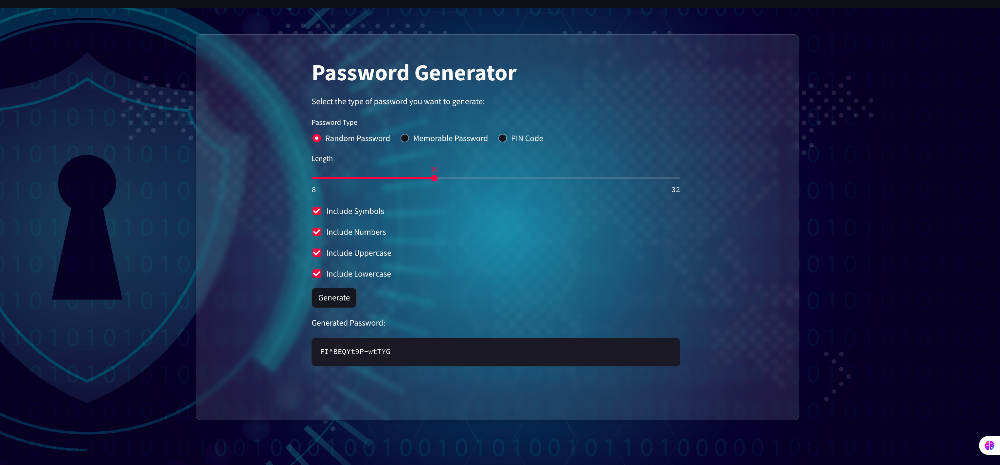

# 🔐 Password Generator App

A sleek, responsive, and secure **Streamlit-based Password Generator** that allows users to create strong, memorable, or PIN-style passwords with ease. The app features a modern UI with background image, transparency effects, and multiple customizable options.


## 🚀 Features

* ✅ **Random Password Generator**
  Create strong, customizable passwords using:

  * Symbols
  * Numbers
  * Uppercase and lowercase letters
  * Adjustable length (8–32 characters)

* 💡 **Memorable Password Generator**
  Generate easy-to-remember passphrases with:

  * Custom word count
  * Optional separators
  * Capitalization toggle
  * Optional custom vocabulary input

* 🔢 **PIN Code Generator**
  Create numeric codes (4–16 digits)

* 🎨 **Customizable UI**

  * Transparent and blurred card design
  * Background image for enhanced visual appeal

## 🖥️ Preview

<p align="center">
  
</p>

## 🛠️ Technologies Used

* [Streamlit](https://streamlit.io/)
* Python 3.9+
* `base64` for background image encoding
* Custom `password_generators` module (local)

## 📁 Project Structure

```
.
├── image
│   ├── background.jpg
│   └── preview.png
├── README.md
└── src
    ├── app.py
    ├── password_generators.py
    └── __pycache__
        └── password_generators.cpython-313.pyc

4 directories, 6 files

```

## ▶️ How to Run

1. **Clone this repository**

   ```bash
   git clone git@github.com:Amin-Abdolahi/App-password-generator-dashboard.git
   cd App-password-generator-dashboard
   ```

2. **Install dependencies**

   (Use a virtual environment if preferred)

   ```bash
   pip install streamlit
   pip install nltk==3.8.1

   ```

3. **Run the app**

   ```bash
   streamlit run app.py
   ```

## 📦 Future Enhancements

* ✅ Copy to clipboard button (using `pyperclip`)
* 🌍 Multi-language support
* 🔐 Save/export generated passwords securely

## 💡 Tip

If Streamlit can't locate background or data files, make sure your working directory is correct, or export the correct path like this:

```bash
export PYTHONPATH="${PYTHONPATH}:$(pwd)"
```

---

## 📜 License

This project is licensed under the MIT License. Feel free to use and modify.

---

> Designed with ❤️ using Streamlit

---

If you want me to generate a copy-to-clipboard button or integrate clipboard functionality using `pyperclip`, just let me know!
